# NoSQL Домашнє завдання #1

Документоорієнтована модель даних MongoDB на датасеті **Spotify Tracks Dataset**
(113 999 треків у колекції `tracks` після очищення одного неповного запису).

Приклад документа підсумкової схеми, на який спираються відповіді нижче:

```json
{
  "_id": { "$oid": "6a2eef44570ec222f562ff0f" },
  "track_id": "5SuOikwiRyPMVoIQDJUgSV",
  "track_name": "Comedy",
  "album_name": "Comedy",
  "artists": ["Gen Hoshino"],
  "track_genre": "acoustic",
  "explicit": false,
  "popularity": 73,
  "duration_ms": 230666,
  "duration_sec": 230.7,
  "popularity_tier": "high",
  "audio_features": {
    "danceability": 0.676, "energy": 0.461, "loudness": -6.746,
    "speechiness": 0.143, "acousticness": 0.0322, "instrumentalness": 0.00000101,
    "liveness": 0.358, "valence": 0.715, "tempo": 87.917,
    "key": 1, "mode": 0, "time_signature": 4
  }
}
```

---

## Частина 1 Завантаження та схема

### 1.1. Чому аудіо-характеристики винесені в окремий об'єкт `audio_features`, а не зберігаються плоско? Коли таке вкладення вигідне, а коли створює проблеми?

Аудіофічі - це один логічно цілісний піддомен (результат аудіоаналізу треку), на відміну
від метаданих (`track_name`, `album_name`, `artists`, `popularity`). Винесення їх у вкладений
об'єкт дає три переваги:

- **Семантична межа** - у документі одразу видно, де метадані, а де числові характеристики
  звучання. Структура самодокументується.
- **Зручні групові операції** - увесь блок можна сховати чи повернути однією проєкцією
  (`{ audio_features: 0 }` або `{ "audio_features": 1 }`), не перелічуючи всі 12 полів.
- **Незалежна еволюція схеми** - нову фічу додаємо всередину об'єкта, не засмічуючи
  кореневий рівень документа.

**Коли вкладення вигідне:** поля логічно єдині, майже завжди читаються/пишуться разом,
а корінь документа лишається компактним і читабельним.

**Коли створює проблеми:** при надмірній або глибокій вкладеності запити й індекси стають
громіздкими - скрізь доводиться писати dotted-path (`audio_features.danceability`), важче
читати плани виконання, а дуже великі вкладені об'єкти роздувають документ. Якби замість
одного об'єкта це був **масив** вкладених об'єктів, ускладнилася б і фільтрація (знадобились
би `$elemMatch` / `$unwind`). У нашому випадку це плаский об'єкт фіксованої форми, тож індекс
по `audio_features.danceability` будується й працює без проблем (підтверджено в Частині 4).

### 1.2. Чому виконавці зберігаються як масив, а не як рядок? Які запити стають простішими?

Один трек може мати кількох виконавців (колаборації) - це природне відношення *many-to-many*,
яке масив моделює коректно, а рядок `"A;B"` - ні. У сирих даних артисти йшли одним рядком із
роздільником `;`; під час трансформації ми розбили його по `;`, прибрали пробіли (`$trim`)
і зберегли як масив `artists`.

Простішими стають:

- **Пошук треків конкретного артиста**: `db.tracks.find({ artists: "Gen Hoshino" })` -
  MongoDB автоматично зіставляє елемент масиву, без `regex` чи `split`.
- **Агрегації «по артисту»**: `$unwind: "$artists"` -> `$group` дає коректну статистику на
  кожного учасника окремо (саме так працюють Частина 2 завдання 2 і Частина 3 завдання 1).
- **Multikey-індекс** по `artists` індексує кожне ім'я окремо.

З рядком довелося б на кожному запиті виконувати `regex` (повільно й неточно: пошук `"Lo"`
зачепив би і «Lorde», і «Florence»), а точний індекс по окремому імені побудувати було б
неможливо.

### 1.3. Що таке `$out` і чим він відрізняється від `$merge`? Коли використовувати кожен?

**`$out`** записує результат пайплайна в цільову колекцію, **повністю замінюючи** її вміст:
стара колекція очищається й перестворюється атомарно. Просто й безпечно для повної перебудови
«з нуля» - саме тому ми застосували його в `02_transform.js` (`tracks_raw` -> `tracks`).

**`$merge`** **інкрементально зливає** результат у наявну колекцію за правилами `whenMatched`
(replace / merge / keepExisting / fail) та `whenNotMatched` (insert / discard / fail),
з підтримкою upsert. Він гнучкіший: може писати в будь-яку БД і навіть у шардовану колекцію,
не чіпаючи документи поза результатом.

**Коли що використовувати:**
- `$out` - повна одноразова трансформація, коли цільову колекцію треба перебудувати цілком
  (наш кейс).
- `$merge` - інкрементальні оновлення, on-demand materialized views, донакопичення даних,
  коли наявні документи треба зберегти й лише оновити/доповнити. Практичний наслідок:
  `$out` **не вміє** писати в шардовану колекцію, а `$merge` - вміє.

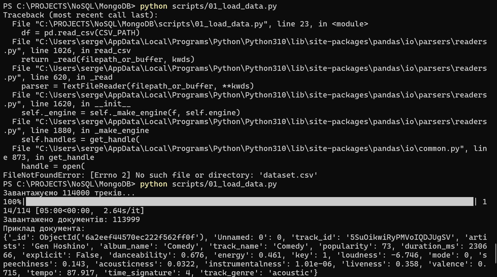
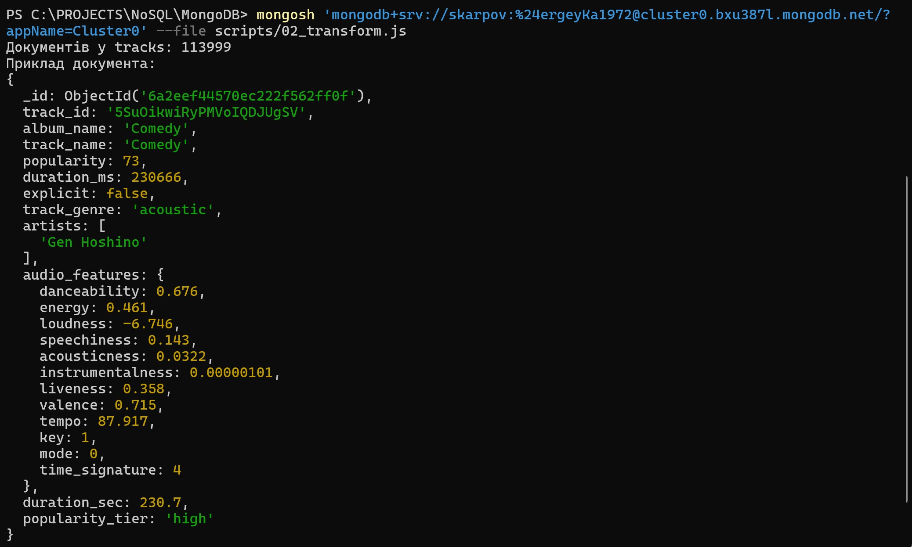

---

## Частина 2 - Запити

### 2.1. Для чого використовується інструкція `$unwind`?

`$unwind` розгортає масив: для кожного елемента масиву створює окремий документ-копію, у якому
поле-масив замінено одним його елементом. Наприклад, документ із `artists: ["A", "B"]` стає
двома документами - `artists: "A"` та `artists: "B"`. Це дозволяє далі **групувати,
фільтрувати й рахувати по окремих елементах** масиву. У завданні 2.2 саме `$unwind: "$artists"`
дає змогу порахувати статистику (кількість треків, мінімальну та середню популярність) на
кожного виконавця окремо. Корисні опції: `preserveNullAndEmptyArrays` (не втрачати документи
з порожнім або відсутнім масивом) і `includeArrayIndex` (зберегти індекс елемента).

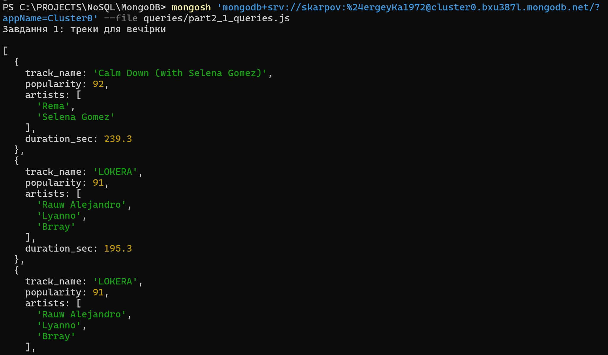

### 2.2. Чим `$stdDevPop` відрізняється від `$stdDevSamp`?

Обидва оператори рахують стандартне відхилення, але для різних статистичних ситуацій:

- **`$stdDevPop`** - стандартне відхилення **популяції** (ділення на `N`). Застосовується,
  коли наявні дані є **всією генеральною сукупністю**.
- **`$stdDevSamp`** - **вибіркове** відхилення (ділення на `N-1`, поправка Бесселя).
  Застосовується, коли дані - це **вибірка** з більшої сукупності, за якою оцінюють відхилення
  всієї сукупності.

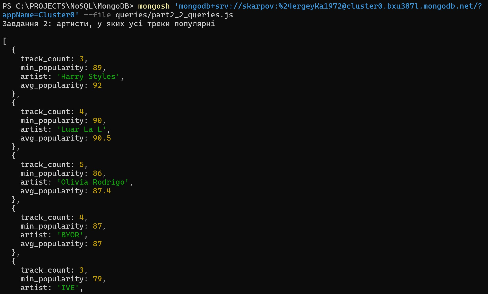

У завданні 2.3 ми беремо **всі** треки кожного жанру з нашої бази як повну сукупність для
розрахунку порогу викидів (`mean + 2 * stdDev`), тому коректним є саме **`$stdDevPop`**.

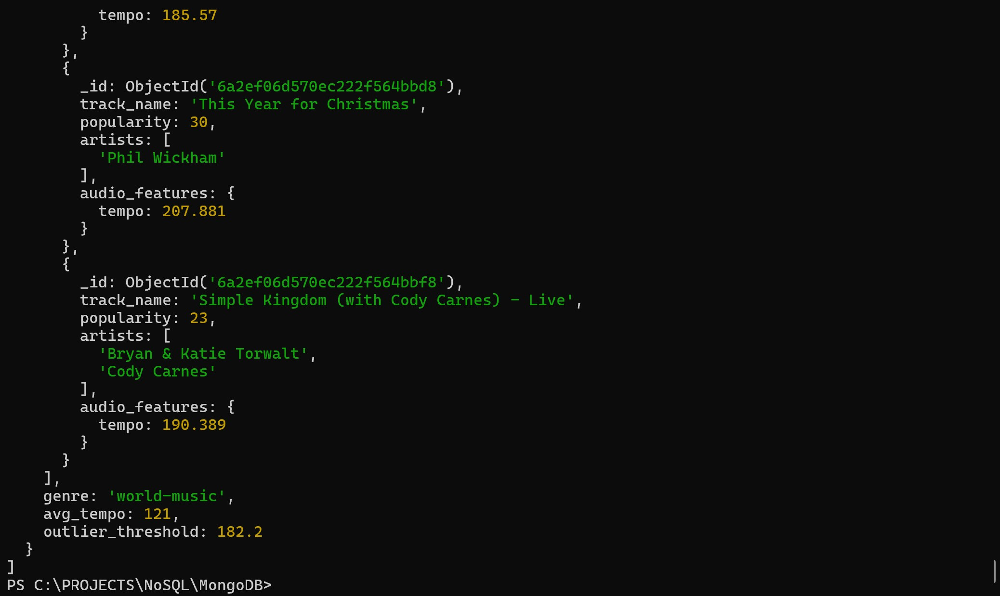
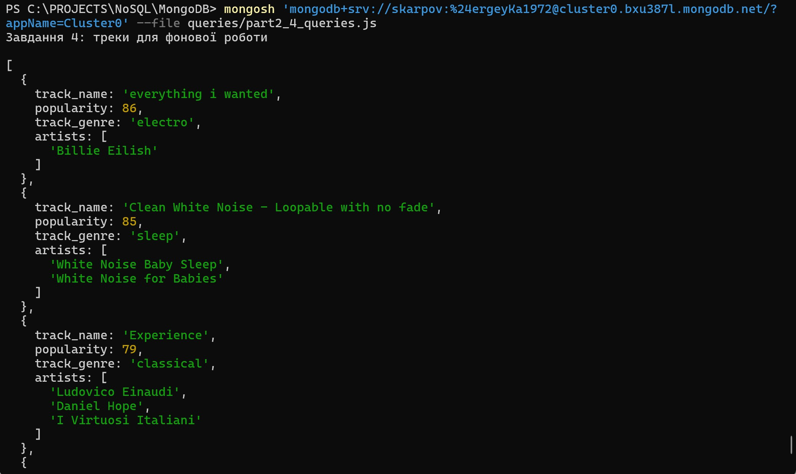

---

## Частина 3 - Аналітика

### 3.1. Запит 1: поріг `≥ 5` треків. Як зміниться результат при `1` і при `> 50`?

Тут діє компроміс між **надійністю середнього** і **охопленням виконавців**.

**Поріг 1** - у вибірку потрапляють артисти з 1–2 треками. Середнє по одному треку дорівнює
популярності цього єдиного треку, тож топ заполонять «одногітники»: виконавець з однією піснею
популярності 95 дасть середнє 95 і витіснить артистів зі стабільно високими, але усередненими
по десятках треків показниками. Результат стає **нерепрезентативним** - це статистичний шум,
бо фактично ранжуються окремі хіти, а не виконавці.

**Поріг > 50** - лишаються тільки дуже плодовиті виконавці з великим каталогом. Таких **мало**,
а їхня середня популярність зазвичай **нижча**: великий каталог неминуче містить багато
прохідних треків, які «розмивають» середнє вниз. Тож із топу зникнуть якісні артисти з
компактною, але сильною дискографією, а сам список результату стане суттєво коротшим.

Поріг 5 - розумний баланс: достатньо треків для стійкого середнього, але не настільки високий,
щоб відсікати хороших артистів.

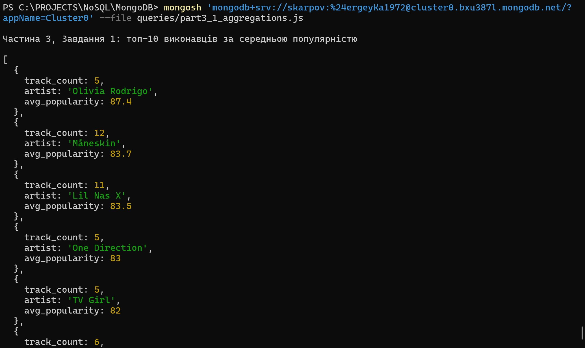

### 3.2. Запит 3: поріг `≥ 100` треків на жанр. Чи зміниться результат при `50`?

**Практично результат не зміниться.** Причина - у структурі датасету: Spotify Tracks Dataset
спроєктований збалансованим, ~114 000 треків поділені приблизно порівну між ~114 жанрами,
тобто **~1000 треків на жанр**. Оскільки кожен жанр і так має близько тисячі треків, і поріг
100, і поріг 50 проходять **усі** жанри однаково - жоден жанр не балансує на межі 50–100, щоб
то випадати, то проходити. Тому і список, і переможець (найтанцювальніший жанр) лишаться
тими самими.

Сам фільтр тут - це **запобіжник статистичної надійності**: він страхує від ситуації, коли
крихітний жанр із кількома треками випадково показав би аномально високу середню
`danceability` і потрапив у топ незаслужено. Для цього збалансованого датасету поріг не
критичний (хоч 50, хоч 100), але як практика він правильний - на незбалансованих даних саме
він відсікає шум від малих груп.

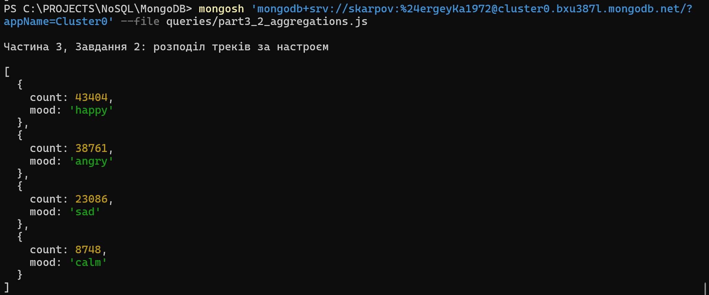
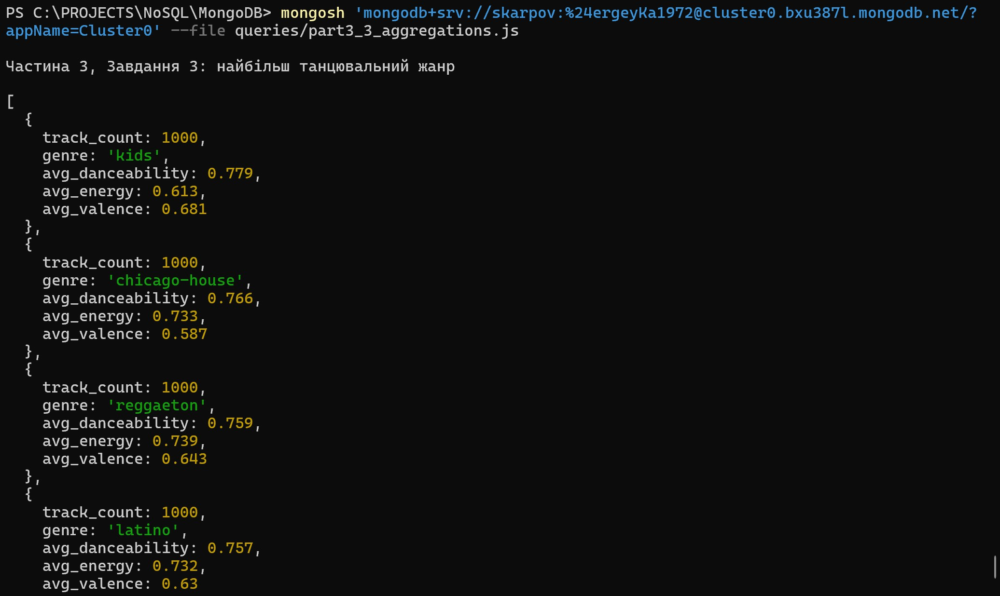

---

## Частина 4 - Індекси та оптимізація

Усі скрипти - у `queries/part4_indexes.js`. Нижче наведено ключові поля з реального виводу
`explain("executionStats")`. *(Скріншоти відповідних блоків виводу - у теці `screenshots/`.)*

### Завдання 1 - аналіз запиту та індексація

Запит:
```js
db.tracks.find({ track_genre: "pop", "audio_features.danceability": { $gte: 0.7 } })
         .sort({ popularity: -1 });
```
Створений індекс (правило **ESR**: Equality -> Sort -> Range):
```js
{ track_genre: 1, popularity: -1, "audio_features.danceability": 1 }   // name: genre_pop_dance
```

#### 4.1.1. Що змінилося в плані виконання?

**До індексу** план складався з двох стадій: `COLLSCAN` (повне сканування) -> `SORT`
(сортування в пам'яті). MongoDB прочитав **усі 113 999 документів**, відфільтрував їх і
окремо відсортував 354 знайдені треки за `popularity`. На це пішло **85 мс**.

**Після створення індексу** план став `IXSCAN` -> `FETCH`. Рівність `track_genre: "pop"`
обмежила діапазон ключів індексу, тож движок прочитав лише **354 документи** замість 113 999.
**Стадія `SORT` зникла повністю** - оскільки `popularity` стоїть в індексі другим полем
(за спаданням), дані вже надходили впорядкованими. Час виконання впав з 85 мс до **2 мс**
(~у 40 разів). У плані видно `indexName: "genre_pop_dance"`, межі індексу
`track_genre: ["pop","pop"]`, `audio_features.danceability: [0.7, inf]`.

#### 4.1.2. Як зрозуміти, що індекс використовується?

Конкретні значення з `executionStats` мого запуску:

| Поле | ДО індексу | ПІСЛЯ індексу |
|---|---|---|
| `executionStages.stage` | `SORT` -> `COLLSCAN` | `FETCH` -> `IXSCAN` |
| `indexName` | - | `genre_pop_dance` |
| стадія `SORT` | присутня | **відсутня** |
| `totalKeysExamined` | **0** | **412** |
| `totalDocsExamined` | **113 999** | **354** |
| `nReturned` | 354 | 354 |
| `executionTimeMillis` | **85** | **2** |

Те, що індекс **використовується**, доводять такі поля з блоку «після»:
- `executionStages.inputStage.stage === "IXSCAN"` (а не `COLLSCAN`);
- `inputStage.indexName === "genre_pop_dance"`;
- `totalKeysExamined === 412 > 0` (до індексу було `0` - ознака `COLLSCAN`);
- у плані **немає стадії `SORT`** — сортування покрите порядком ключів індексу;
- `totalDocsExamined` впав зі `113 999` до `354` - рівно стільки, скільки повернуто.

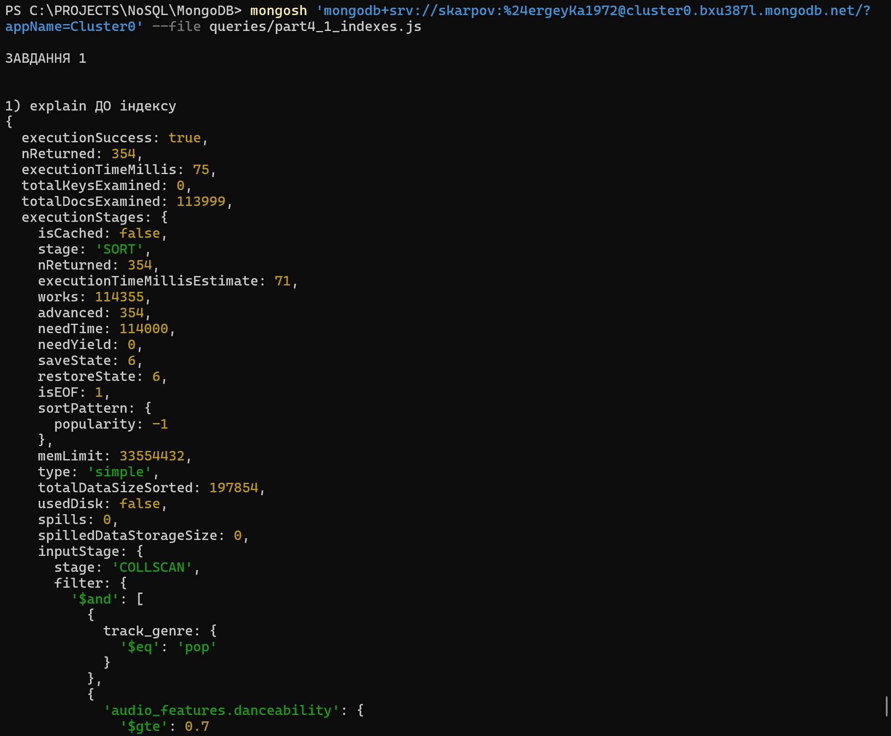

### Завдання 2 - складений індекс для «музики для роботи»

```js
db.tracks.createIndex(
  { explicit: 1, "audio_features.instrumentalness": 1, "audio_features.speechiness": 1 },
  { name: "work_music_idx" }
);
```
`explicit` (точний збіг) поставлено першим за правилом ESR, далі — діапазонні
`instrumentalness` / `speechiness`. Запит
`{ explicit:false, "audio_features.instrumentalness":{$gt:0.5}, "audio_features.speechiness":{$lt:0.1} }`
у `explain` показав використання індексу:

| Поле | Значення |
|---|---|
| `inputStage.stage` | `IXSCAN` |
| `indexName` | `work_music_idx` |
| `totalKeysExamined` | 16 602 |
| `totalDocsExamined` | 16 141 |
| `nReturned` | 16 141 |
| `executionTimeMillis` | 35 |

Межі індексу з виводу: `explicit: [false, false]`,
`audio_features.instrumentalness: (0.5, inf]`, `audio_features.speechiness: [-inf, 0.1)` -
тобто всі три умови запиту обслуговуються індексом. `IXSCAN` із коректним `indexName`
підтверджує, що `work_music_idx` задіяний.

### Завдання 3 - покривний запит (covered query)

Запит:
```js
db.tracks.find({ track_genre: "pop", popularity: { $gte: 70 } });
```
Наявний індекс (із завдання 1): `{ track_genre: 1, popularity: -1, "audio_features.danceability": 1 }`.

#### 4.3.1. Чи є цей запит покривним?

**Відповідь: ні, цей запит у наведеному вигляді (без проєкції) НЕ є покривним**, що прямо
підтверджується виводом `explain()`.

Індекс **задіюється для пошуку**: фільтр використовує `track_genre` (рівність - перше поле
індексу) і `popularity` (діапазон - друге поле), тож план починається з `IXSCAN` по
`genre_pop_dance` з межами `track_genre: ["pop","pop"]`, `popularity: [inf, 70]`. Прочитано
лише 317 ключів - індекс ефективно звужує пошук.

Але запит **не покривний**, бо `find()` без проєкції повертає **весь документ** (`track_name`,
`album_name`, `artists`, `audio_features` тощо), а цих полів в індексі немає. Тому в плані є
стадія **`FETCH`**, і движок дочитує реальні документи з колекції. Числа з виводу «без
проєкції»:

| Поле | Значення |
|---|---|
| `executionStages.stage` | **`FETCH`** -> `IXSCAN` |
| `totalKeysExamined` | 317 |
| `totalDocsExamined` | **317** (> 0) |
| `nReturned` | 317 |

Наявність `FETCH` і `totalDocsExamined === 317 > 0` і означають, що запит **не покривний**.

**Коли він стає покривним:** якщо додати проєкцію лише по полях індексу й явно виключити `_id`
(бо `_id` у цей індекс не входить):
```js
db.tracks.find({ track_genre: "pop", popularity: { $gte: 70 } },
               { _id: 0, track_genre: 1, popularity: 1 });
```
Тоді `explain()` показує іншу картину:

| Поле | Без проєкції | З проєкцією `{_id:0, track_genre:1, popularity:1}` |
|---|---|---|
| `executionStages.stage` | `FETCH` -> `IXSCAN` | **`PROJECTION_COVERED`** -> `IXSCAN` |
| стадія `FETCH` | присутня | **відсутня** |
| `totalKeysExamined` | 317 | 317 |
| `totalDocsExamined` | **317** | **0** |
| `nReturned` | 317 | 317 |

**Висновок:** головна ознака покривного запиту - `totalDocsExamined === 0` і стадія
`PROJECTION_COVERED` замість `FETCH`: усі дані беруться **виключно з індексу**, без жодного
звернення до документів колекції. Початковий запит (без проєкції) цій умові не відповідає
(`totalDocsExamined === 317`, є `FETCH`), тож він **не покривний**; покривним його робить
проєкція по індексних полях із `_id: 0`.

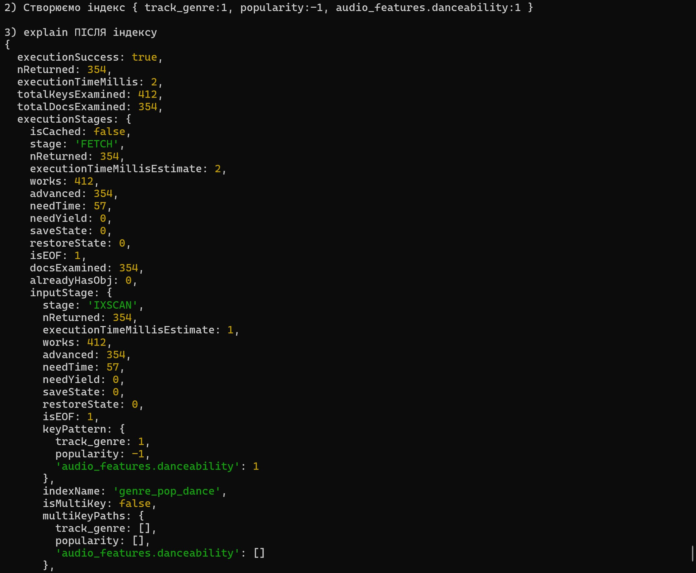

[Результат плану виконання повільних запитів](screenshots/Result_part4_queries_js.txt)
